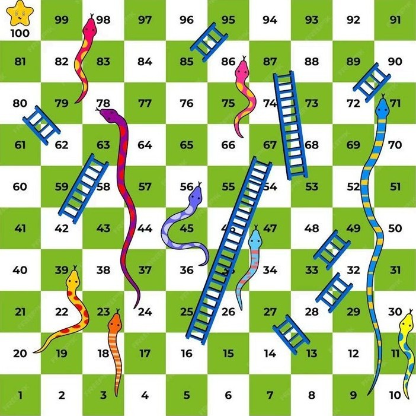

# 🎲 Snake and Ladder Game

A fun and interactive **Snake and Ladder** game built using **HTML, CSS, and JavaScript**. This browser-based game supports two players and brings the classic board game experience to life with sound effects, animated dice, and a visual board.

## 🕹️ Features

- 🎮 Two-player gameplay (Yellow vs Red)
- 🎲 Click to roll a virtual dice
- 🐍 Snakes and 🪜 Ladders implemented with logic
- 📦 Visual game board with 100 numbered cells
- 🔊 Sound effects for dice roll and victory
- 🎨 Custom styling and background

## 📁 Files

- `index.html` - Main game structure
- `style.css` - Game styling and board layout
- `dummy.js` - Game logic and interactivity
- `board.jpg` - Snake and ladder board image
- `snake_background.jpg` - Page background
- `dice.mp3`, `vic.mp3` - Sound effects
- `1.jpg` to `6.jpg` - Dice face images

## 🛠️ How to Run

1. Clone or download the repository.
2. Make sure all images and sounds are in the same folder as the HTML file.
3. Open `index.html` in your browser.
4. Click the dice to start playing.

## 📸 Screenshots

*Game Board View*

## 🚀 Future Improvements

- Add restart or reset button
- Track player wins and moves
- Support single-player vs computer mode
- Responsive design for mobile

## 💡 Built With

- HTML5
- CSS3
- JavaScript (Vanilla)

## 👨‍💻 Author

Created by a beginner web developer to explore DOM manipulation, event handling, and styling.

---

Enjoy the game! 🎉
